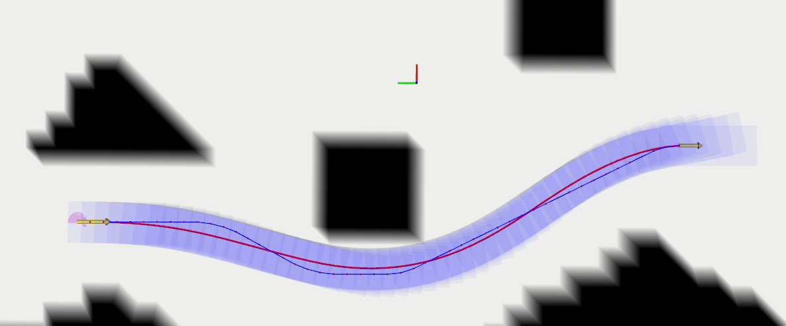

# hybridAstar_lbfgsSmooth
hybrid astar with smooth, optimization solver is lbfgs

## 运行效果



如图所示，黑色为障碍物，细蓝色带点的是混合A星搜索出来的路径点，红色是优化后的路径。

## 安装依赖

1 安装grid_map

```
sudo apt-get install ros-$ROS_DISTRO-grid-map
```

2 安装OMPL运动规划库

去官网https://ompl.kavrakilab.org/installation.html安装一下

## 编译运行

创建一个工作空间

把src放入工作空间后`catkin_make`编译即可.
